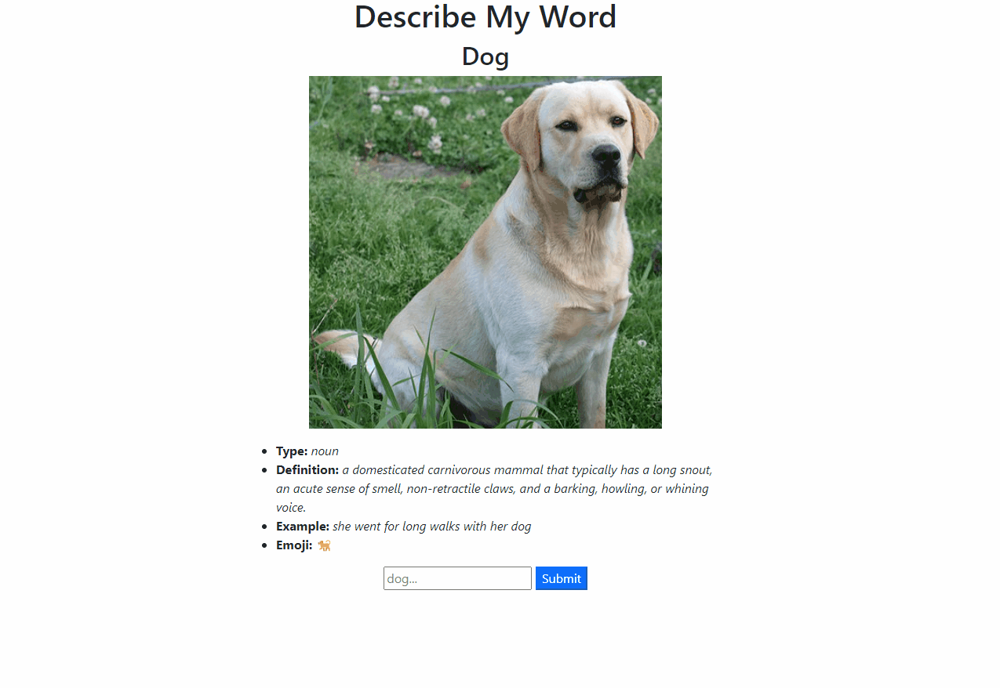

# Dictionary Results Web App

* Dictionary web app made for <A href="https://www.udemy.com/course/100-days-of-code/">100 days of code on Udemey.</A>
* Uses the <a href='https://owlbot.info/'>Owlbot</a> dictionary api.  

</img>
